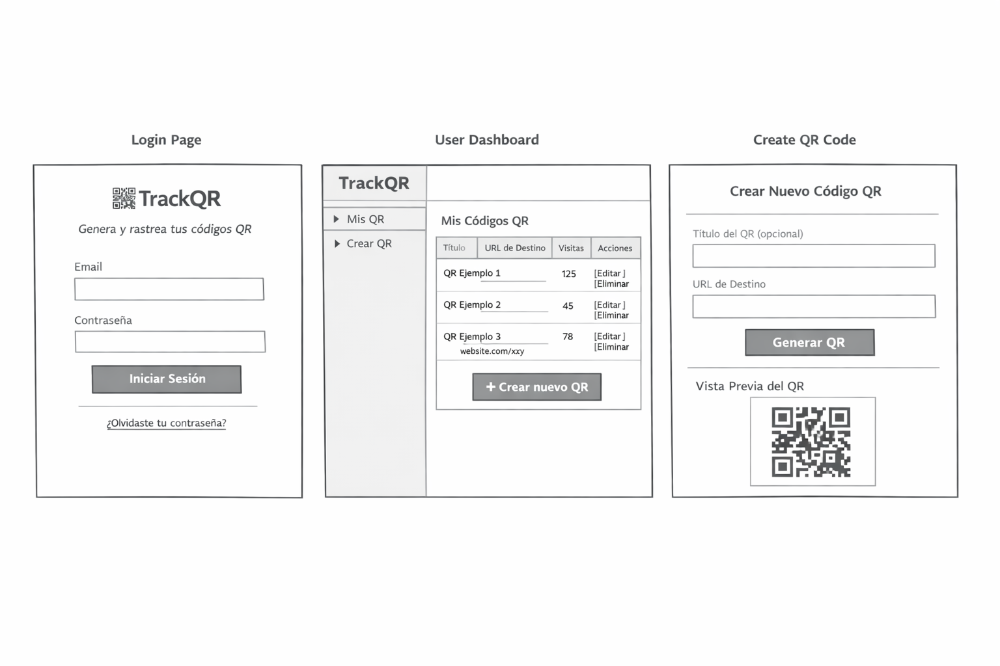
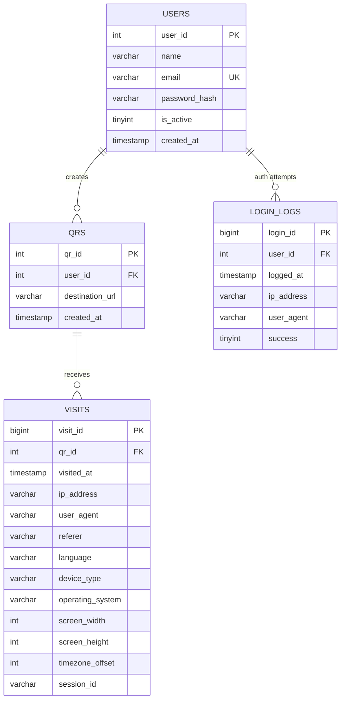

# TrackQR

# TrackQR

TrackQR es una aplicación web (enfoque backend) para **generar códigos QR asociados a un usuario logueado** y **medir escaneos/visitas** de cada QR mediante un endpoint de tracking.

La idea del proyecto es didáctica: Como base para enseñar un backend con autenticación, modelos, controladores, endpoints REST, y registro de métricas.

---

## Objetivo del proyecto

- Permitir que un **usuario autenticado** cree códigos QR.
- Cada QR apunta a una URL de tracking del estilo:
  - `/q/{code}` o `/r/{code}`
- Cuando alguien escanea ese QR:
  - Se registra una **visita** (métrica)
  - Se redirige al **destino final** configurado

---

## Features (MVP)

### Autenticación
- Registro (opcional) / Login
- Sesión o token (según el stack que implementes)
- Rutas protegidas para gestionar QRs

### Gestión de QRs
- Crear QR con:
  - `title` (opcional)
  - `destination_url` (URL final)
  - `code` (slug/hash único)
  - `created_by` (usuario)

### Tracking de visitas
- Endpoint público:
  - `GET /q/{code}`
- Acciones:
  1. Buscar el QR por `code`
  2. Registrar visita con metadatos básicos
  3. Redirigir a `destination_url`

---

## Estructura sugerida (MVC)

> Ejemplo genérico (adaptable a PHP MVC, Node/Express MVC, etc.)

## 🗄️ Modelo de Datos

### ERD (Entity Relationship Diagram)

